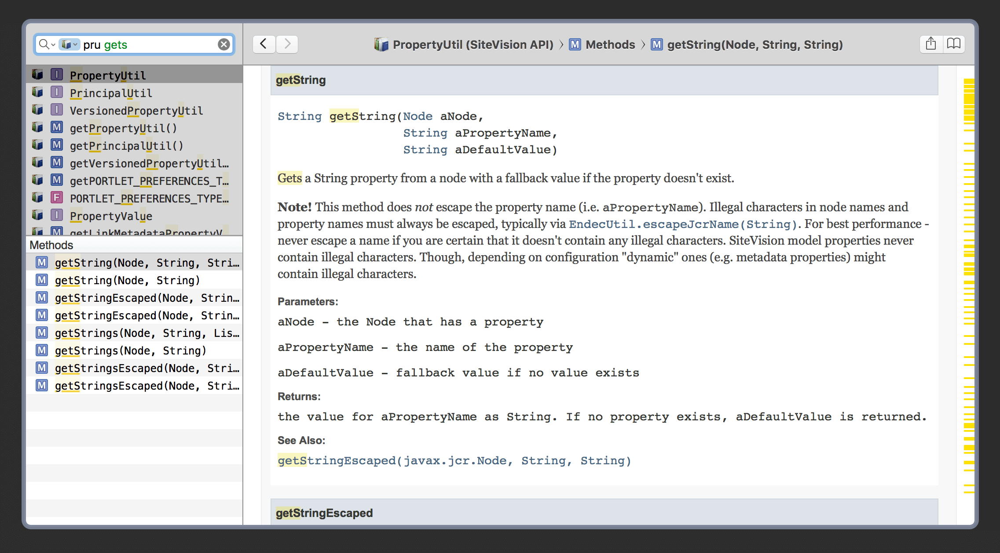

# SiteVision API Dash Documentation Set

A simple makefile to [generate a Documentation Set][1] for use in the OS X and iOS app [Dash][2].

[1]: https://kapeli.com/docsets
[2]: https://kapeli.com/dash

## How to generate and install

Just runt `make` to generate the file `build/SiteVision.docset` and install it to Dash.
